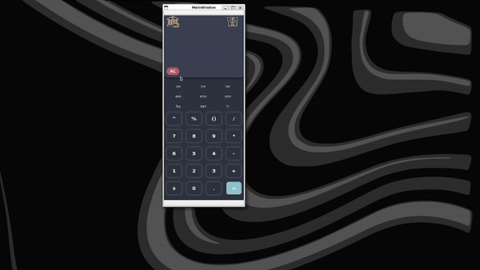

# SmartCalc v2.0


Welcome to SmartCalc v2.0, an advanced calculator application developed in C++ using the C++17 standard. SmartCalc v2.0 is designed to perform a wide range of mathematical operations, from basic arithmetic to complex functions involving variables and plotting graphs. This document provides a comprehensive guide to installing, building, and using SmartCalc v2.0.

## Key Features

* **Comprehensive Arithmetic Support:** Perform calculations with integers and real numbers, including support for exponential notation.
* **Advanced Mathematical Functions:** Calculate trigonometric functions, logarithms, square roots, and more.
* **Graph Plotting:** Visualize functions with variable x, complete with coordinate axes, scale marks, and an adaptive grid.
* **Financial Calculators:**
  * **Credit Calculator:** Calculate monthly payments, total payment, and overpayment for loans.
  * **Deposit Calculator:** Evaluate deposit profitability, including accrued interest and tax impacts.

## Getting Started

### Installation

SmartCalc v2.0 can be compiled and installed using the provided Makefile. Ensure you have the C++17 compiler and Qt library installed on your system. To install the application:

```bash
make install
```

This command compiles the code, builds the GUI, and prepares the application for use.

### Building the Application

The Makefile includes targets for building the application, cleaning build files, running tests, and more:

* **all:** Compiles and builds the entire project.
* **clean:** Removes all build-related files.
* **test:** Executes unit tests to verify the correctness of the application.
* **install:** Compiles the application and prepares it for execution.

To build SmartCalc v2.0, run:

```bash
make all
```

## Usage

Upon launching SmartCalc v2.0, you'll be greeted with a user-friendly interface designed for ease of use across various calculations.

### Basic Calculations and Graph Plotting

1. **Main Interface:**

    

2. **Graph Plotting**

    

## Contributing

Contributions to SmartCalc v2.0 are welcome. Please ensure your contributions adhere to the Google C++ Style Guide and include appropriate unit tests to maintain the quality and reliability of the application.

## License
SmartCalc v2.0 is released under the MIT License. See the [LICENSE](LICENSE) file for more details.